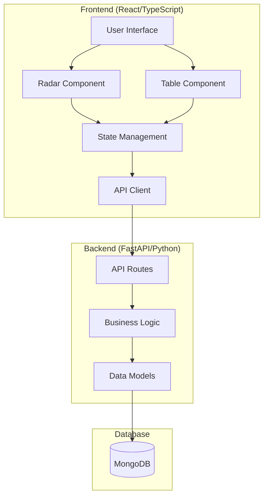

# Design Document

## Overview

The Tech Radar application is a full-stack web application that provides a visual representation of technology adoption within an organization. The system consists of a FastAPI backend with MongoDB storage and a React/TypeScript frontend with interactive radar visualization. The design builds upon the existing table-based interface to add a comprehensive radar view while maintaining the current CRUD operations and extending them with enhanced filtering, search, and visualization capabilities.

## Architecture

### High-Level Architecture



### Technology Stack

**Frontend:**

-   React 18 with TypeScript
-   Vite for build tooling
-   TanStack Query for data fetching and caching
-   Zod for runtime type validation of API responses
-   D3.js or SVG for radar visualization
-   Ant Design for UI components
-   Zustand for state management (already in use)

**Backend:**

-   FastAPI with Python 3.11
-   Beanie ODM for MongoDB integration
-   Pydantic for data validation
-   MongoDB for data persistence

## Components and Interfaces

### Frontend Components

#### 1. Radar Visualization Component (`RadarChart`)

**Purpose:** Renders the interactive tech radar visualization

**Props:**

```typescript
interface RadarChartProps {
	technologies: Technology[];
	selectedTechnology?: Technology;
	onTechnologyClick: (technology: Technology) => void;
	onTechnologyHover: (technology: Technology | null) => void;
	filters: RadarFilters;
}
```

**Key Features:**

-   SVG-based circular radar with quadrants for categories
-   Concentric rings for stages (Hold, Assess, Trial, Adopt)
-   Interactive technology dots with hover effects
-   Responsive design with zoom/pan capabilities
-   Legend and stage/category labels

#### 2. Technology Detail Modal (`TechnologyDetailModal`)

**Purpose:** Displays comprehensive technology information

**Props:**

```typescript
interface TechnologyDetailModalProps {
	technology: Technology | null;
	isOpen: boolean;
	onClose: () => void;
	onEdit?: (technology: Technology) => void;
}
```

**Features:**

-   Technology metadata display
-   Stage transition history timeline
-   Links to ADRs and detail pages
-   Edit button for administrators

#### 3. Search and Filter Panel (`FilterPanel`)

**Purpose:** Provides search and filtering controls

**Props:**

```typescript
interface FilterPanelProps {
	filters: RadarFilters;
	onFiltersChange: (filters: RadarFilters) => void;
	availableTags: string[];
	availableCategories: string[];
}
```

**Features:**

-   Text search input
-   Category multi-select
-   Stage multi-select
-   Tag filtering
-   Clear filters button

#### 4. View Toggle Component (`ViewToggle`)

**Purpose:** Switches between radar and table views

**Props:**

```typescript
interface ViewToggleProps {
	currentView: 'radar' | 'table';
	onViewChange: (view: 'radar' | 'table') => void;
}
```

### Backend API Enhancements

#### Enhanced Technology Endpoints

**GET /technologies**

-   Add query parameters for filtering:
    -   `search`: Text search across name, category, tags
    -   `categories`: Filter by categories
    -   `stages`: Filter by stages
    -   `tags`: Filter by tags

**Response Enhancement:**

```python
class TechnologyResponse(BaseModel):
    technologies: list[Technology]
    metadata: TechnologyMetadata

class TechnologyMetadata(BaseModel):
    total_count: int
    categories: list[str]
    stages: list[str]
    available_tags: list[str]
```

**POST /technologies/{name}** (Enhanced existing endpoint)

-   Keep the single update endpoint for all technology modifications
-   When stage is changed, automatically create stage transition record
-   Require ADR link when stage transitions occur
-   Handle both general updates and stage transitions in one endpoint

## Data Models

### Frontend Type Definitions

```typescript
interface Technology {
	name: string;
	category: string;
	stage: string;
	tags: string[];
	detailsPage?: string;
	history: TechnologyHistory;
}

interface TechnologyHistory {
	discoveryDate: Date;
	stageTransitions: StageTransition[];
}

interface StageTransition {
	originalStage: string;
	transitionDate: Date;
	adrLink: string;
}

interface RadarFilters {
	search: string;
	categories: string[];
	stages: string[];
	tags: string[];
}

interface RadarPosition {
	x: number;
	y: number;
	angle: number;
	radius: number;
}
```

### Backend Model Enhancements

The existing `Technology` model is well-designed and requires minimal changes:

```python
# Add validation for stages and categories
class Technology(Document):
    name: Annotated[str, Indexed(unique=True)]
    category: str = Field(..., regex="^(Tools|Techniques|Platforms|Languages & Frameworks)$")
    stage: str = Field(..., regex="^(Hold|Assess|Trial|Adopt)$")
    tags: list[str]
    detailsPage: str | None
    history: History

    class Settings:
        indexes = [
            [("name", 1)],
            [("category", 1)],
            [("stage", 1)],
            [("tags", 1)]
        ]
```

## Radar Visualization Design

### Coordinate System

The radar uses a polar coordinate system with:

-   **Origin:** Center of the radar
-   **Quadrants:** Four 90-degree sections for categories
-   **Rings:** Concentric circles for stages (outer to inner: Hold, Assess, Trial, Adopt)
-   **Positioning:** Technologies positioned with slight randomization to avoid overlap

### Category Mapping

```typescript
const CATEGORY_ANGLES = {
	Tools: { start: 0, end: 90 },
	Techniques: { start: 90, end: 180 },
	Platforms: { start: 180, end: 270 },
	'Languages & Frameworks': { start: 270, end: 360 },
};
```

### Stage Mapping

```typescript
const STAGE_RADII = {
	Hold: { inner: 200, outer: 250 },
	Assess: { inner: 150, outer: 200 },
	Trial: { inner: 100, outer: 150 },
	Adopt: { inner: 50, outer: 100 },
};
```

### Positioning Algorithm

1. Determine quadrant based on technology category
2. Determine ring based on technology stage
3. Generate random angle within quadrant bounds
4. Generate random radius within stage bounds
5. Apply collision detection and adjustment
6. Convert polar to cartesian coordinates

## Error Handling

### Frontend Error Handling

**Network Errors:**

-   Display toast notifications for API failures
-   Implement retry mechanisms with exponential backoff
-   Show offline indicators when appropriate

**Validation Errors:**

-   Form-level validation with immediate feedback
-   Server validation error display
-   Prevent invalid state submissions

**Rendering Errors:**

-   Error boundaries around radar component
-   Fallback to table view on visualization errors
-   Graceful degradation for unsupported browsers

### Backend Error Handling

**Validation Errors:**

-   Comprehensive Pydantic validation
-   Custom error messages for business rules
-   Structured error responses

**Database Errors:**

-   Connection retry logic
-   Transaction rollback on failures
-   Detailed logging for debugging

**Business Logic Errors:**

-   Duplicate name prevention
-   Stage transition validation
-   Required field enforcement

## Testing Strategy

### Frontend Testing

**Unit Tests:**

-   Component rendering tests with React Testing Library
-   Utility function tests (coordinate calculations, filtering)
-   State management tests (Zustand store)
-   API client tests with MSW (Mock Service Worker)

**Integration Tests:**

-   User interaction flows (search, filter, select)
-   API integration tests
-   Radar visualization interaction tests

**Visual Tests:**

-   Snapshot tests for component rendering
-   Cross-browser compatibility tests
-   Responsive design tests

### Backend Testing

**Unit Tests:**

-   Model validation tests
-   Business logic tests
-   Utility function tests

**Integration Tests:**

-   API endpoint tests with test database
-   Database operation tests
-   Authentication and authorization tests

**Performance Tests:**

-   Load testing with large datasets
-   Response time benchmarks
-   Memory usage profiling

### End-to-End Testing

**User Workflows:**

-   Complete technology management workflows
-   Radar interaction and navigation
-   Search and filtering scenarios
-   Cross-browser functionality

## Performance Considerations

### Frontend Optimization

**Radar Rendering:**

-   Canvas fallback for large datasets (>500 technologies)
-   Virtualization for off-screen elements
-   Debounced search and filtering
-   Memoized component rendering

**Data Management:**

-   Efficient state updates with Zustand
-   Query caching with TanStack Query
-   Lazy loading of technology details
-   Optimistic updates for better UX

### Backend Optimization

**Database Queries:**

-   Compound indexes for common filter combinations
-   Aggregation pipelines for metadata
-   Connection pooling
-   Query result caching

**API Performance:**

-   Response compression
-   Pagination for large datasets
-   Field selection to reduce payload size
-   Rate limiting for protection

## Security Considerations

### Authentication and Authorization

**Current State:** No authentication implemented
**Future Considerations:**

-   JWT-based authentication
-   Role-based access control (viewer vs. administrator)
-   API key authentication for external integrations

### Data Validation

**Input Sanitization:**

-   Comprehensive Pydantic validation
-   XSS prevention in frontend
-   SQL injection prevention (using ODM)

**Data Integrity:**

-   Unique constraints on technology names
-   Required field validation
-   Stage transition audit trail

## Deployment and Infrastructure

### Development Environment

**Frontend:**

-   Vite dev server on port 5173
-   Hot module replacement
-   TypeScript compilation

**Backend:**

-   Uvicorn ASGI server on port 8000
-   Auto-reload on code changes
-   MongoDB connection via Docker Compose

### Production Considerations

**Frontend:**

-   Static asset optimization
-   CDN deployment
-   Browser caching strategies

**Backend:**

-   Gunicorn with Uvicorn workers
-   Environment-based configuration
-   Health check endpoints
-   Monitoring and logging

**Database:**

-   MongoDB replica set for high availability
-   Regular backups
-   Index optimization
-   Connection pooling
